slidenumbers: false
autoscale: true


### *From* Design *to*
# `{code}`
# <br>
#### **NSSpain 2016 ·** *@pumpkin* **+** *@gonzalezreal*

^ Hello. Thank you so much for joining us today. We’re very excited to be here.

---

# [fit] *Designer* **+** *Developer*
### [fit] with a small side project 

^ We are just two friends who share the same values and principles about creating a product, and decided to start a small side project together to learn, experiment and have some fun.

^ We started working on a TV Shows tracker for iOS, and we would like to share some parts of the process behind it.

---

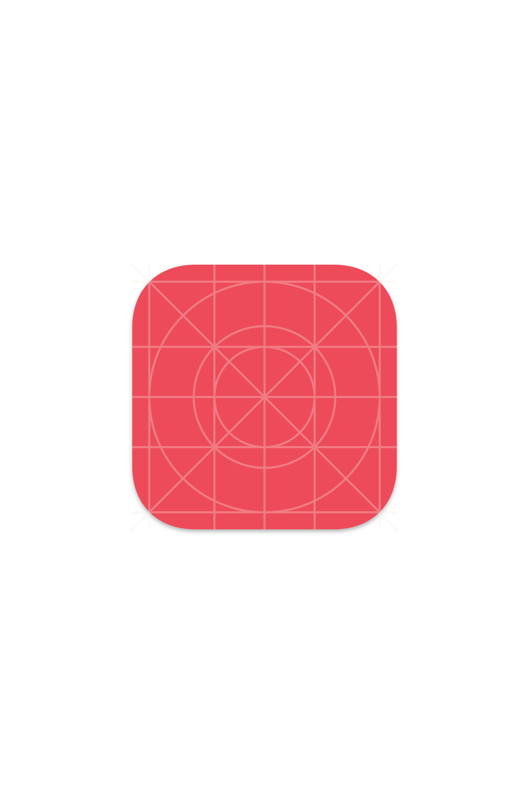

#### **— PART ONE —**
# [fit] *Designing* 
# [fit] the right product
# [fit] *the right way*
#### <br>

^ The design of a product starts way before you put a single pixel on the canvas: *Concept*, *Research*, *Definition*… are some of the few things you need to do first.

^ I’d like to share a few thoughts with you guys, as in my career I have seen many companies failing at things that seem to be really obvious. Let’s get started.

---

#### **First**
# [fit] Our, *not mine*
#### <br>

^ Involving everybody from the start is really important.

^ I know plenty of designers and product managers that fail at this very basic thing.

^ Let’s see an example…

---

# <br>
# My *App*

- I had *this great idea*
- I designed these *awesome mockups*
- You code it *for me*

^ I have something I believe is a great idea. 

^ I start working on it night and day very confident about my outcome…

^ … and then I send someone all my stuff and tell him: “Make it so. Here’s your deadline”. 

^ What can possibly go wrong?

---

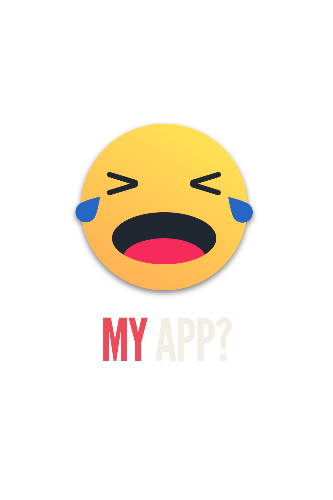

# [fit] ~~Great~~
# [fit] *Incomplete*
# [fit] FAIL

^ Well… as you can imagine that doesn’t work really well…

^ What happens to my app? 

^ Perhaps my super awesome idea wasn’t that great, after all… 

^ Maybe I forgot a lot of edge cases and I didn’t consider a bunch of things.

^ Maybe the whole project gets delayed because you have to rethink things all the time, which is perfect for getting everybody on the team frustrated. 

^ Or even worse: maybe you can’t even get to ship.

---

# <br>
# Our *App?*

- What do you *think?*
- How would you *make it better?*
- Do you want to do this *together?*

^ What about starting by sharing your idea before spending so much effort in it?

^ Every person involved in a project has a unique point of view that can *and will* enrich it. They will find flaws you don’t see and they will simply tell you if your idea is not worth it.

^ But an idea, either good or bad, can be the seed of a new one. In our project, Guille made a great suggestion that completely changed the app, and made it much better than I ever imagined.

^ Team work is all about trust. Knowing that you can leave many details in the hands of a very capable person is fantastic. It only makes things better.

---
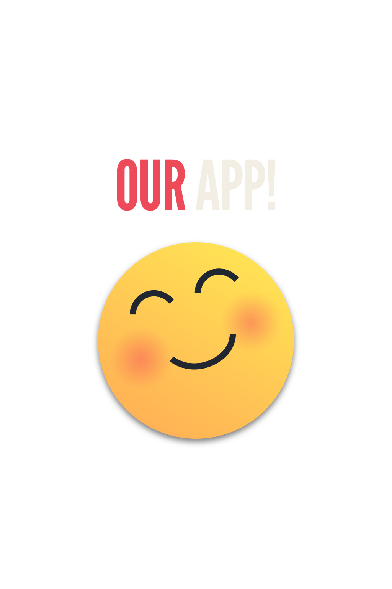

# [fit] Solid 
# [fit] *Complete*
# [fit] Learn Something

^ And what happens here?

^ Maybe your app never sees the light of day either. 

^ There are a lot of factors that can make a project fail… 

^ … but if you are open enough and you listen, you’ll be able to learn a thing or two. And that is priceless.

---

#### **Second**
# [fit] *A battle for* Resources
#### <br>

^ Creating a product is always a battle for resources

---

# *Time*
## **and**
# *Human*

^ What are the most basic resources in a project? Well, there’s time and there’s people

--- 

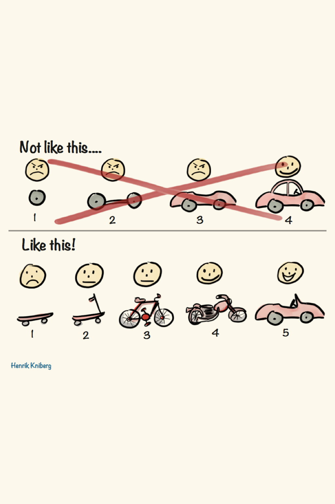

# <br>
## [fit] Cut the scope
## [fit] *Don’t reinvent the wheel*
## [fit] Reuse
## [fit] *And Iterate* [^​​]
 
[^​​]: [blog.crisp.se/2016/01/25/henrikkniberg/making-sense-of-mvp](http://blog.crisp.se/2016/01/25/henrikkniberg/making-sense-of-mvp)

^ Here’s a nice slide that many of you might have seen lots of times already. It’s from a guy that works at Spotify. It serves really well to illustrate my point.

^ Being realistic and practical is very important. The cost of shipping a product with all the features on version 1 is huge. If you start by delivering a basic version of something and you ship it, you will be able to get feedback very early without too much effort. We do this at Sketch a lot, by the way.

^ It is great to be ambitious, but do it in the long term. As Henrik says: “Aim for the clouds… but deliver in small steps”.

^ Think about this slide as something not only for your users, but for you and your team. That angry guy can be you.

---

#### **Third**
# [fit] *Design* Systems
#### <br>

^ What are systems? Basically: a bunch of small components working in sync, some of which can be part of bigger ones. 

^ You might have heard about *Modular Design* or *Atomic Design*. That’s it.

---

# [fit] *To break the rules* 
# [fit] you need to know them

^ Let me start with something: To break the rules you need to know them first. 

^ Unfortunately, I have seen many designers not caring at all about this.

^ It’s ok to want to be fresh and cool, but let’s be honest: Innovation is not that latest Dribbble shot, or copying cool pieces of several applications until your app looks and feels like a Frankenstein. Those pieces without context are nothing but a nightmare for you your team.

^ If you want to innovate for real, first you need to know really well your tools, and make the most of them until they’re not good enough to solve the problem.

---

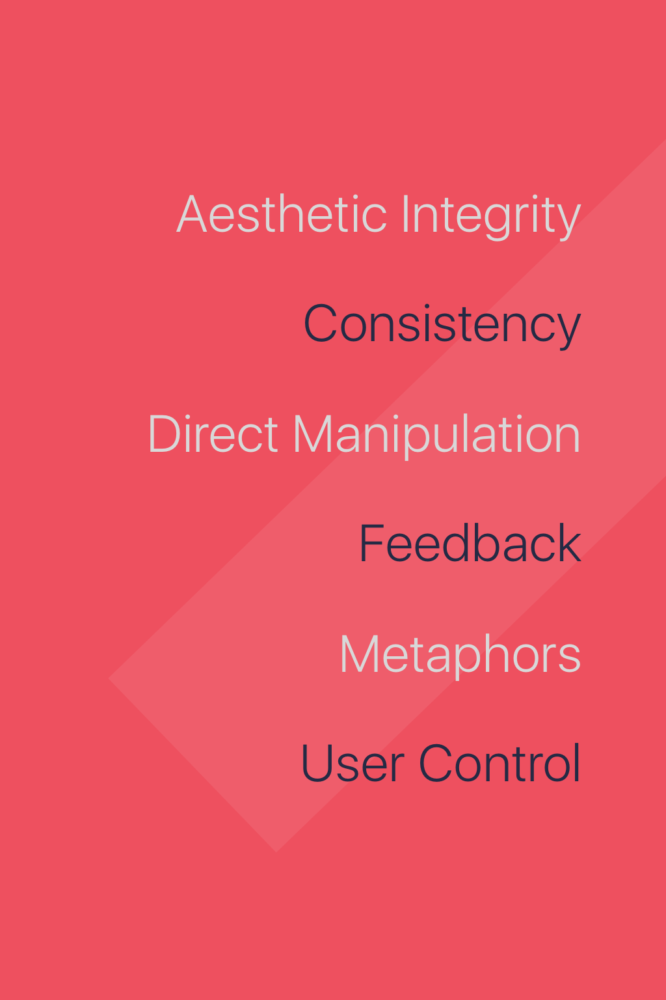

# <br>
# [fit] Human
# [fit] *Interface*
# [fit] Guidelines[^    ]

[^    ]: [developer.apple.com/design](https://developer.apple.com/design/)

^ You know what? Apple makes some *really* good design guidelines. I suggest you read them, as they’ll give you a much deeper sense of why things are the way they are and how to make the most of their system.

^ Same applies for every platform. Google has some truly great guidelines for *Material Design* too.

---

# [fit] *Stay* true to the Platform

^ Each platform has their own unique ways of interacting with them.

^ Forcing patterns from other platforms or trying to put your own design language above the platform one, will force users to learn again how to do things. Ask yourself: Is it worth to make your users feel uncomfortable just to be cool?

^ One of the only companies that can afford this is Google, but that’s because **they’re huge**, and because **they have a lot of resources**. But we are not Google, are we?

---


# <br>
# [FIT] Typography
# [fit] *and*
# [fit] color [^ ]

[^ ]: [lamb.cc/typograph](http://lamb.cc/typograph/) *·* [leaverou.github.io/contrast-ratio](http://leaverou.github.io/contrast-ratio/)

^ Typography and color are two of the most important tools to establish a good visual hierarchy. But you need to do this carefully. Choose too many types or colors and your app will look like a mess.

^ Start by choosing a good typeface. There are plenty of things you can tweak in a font to make it look unique. Choose a base size for your body text and build scale upon it for establishing a clear hierarchy. 

^ Then, there’s color. Three or four colors for text and one or two for easily identifying actions and highlight elements, should be more than enough.

^ Making your app readable and accessible is a must. I suggest you to always check your contrast ratios in order to know you’re doing the right thing.

^ I leave you a couple of tools here for helping you building a typographic scale and check contrast ratios. 

---

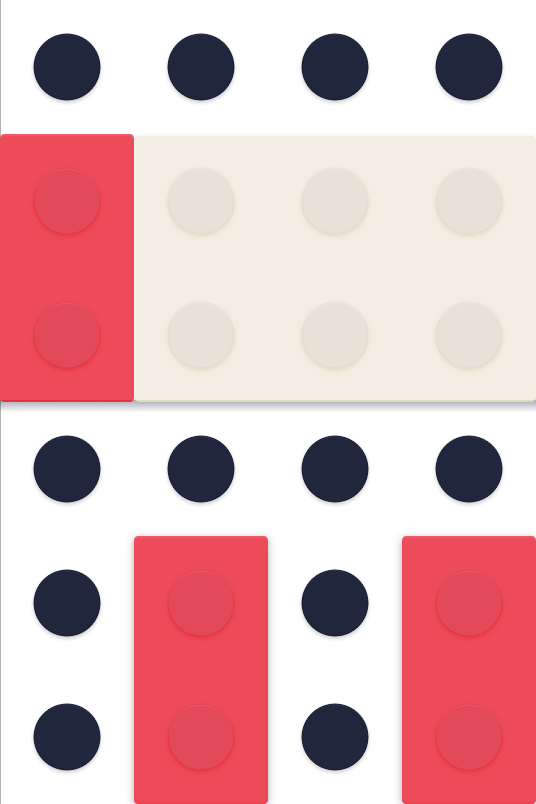

# [fit] *Build a* System *of*
# [fit] *Reusable*
# [fit] Components

^ As I said before, UIKit is great.

^ You also build your own components, but always keep the big picture in mind, and don’t start making exceptions in your design for every situation. If a component doesn’t work, just make it better. And reuse as much as you can.

^ Creating components is an investment. You spend more time in the beginning, but the pace for creating the mockup screens later is really fast.

---

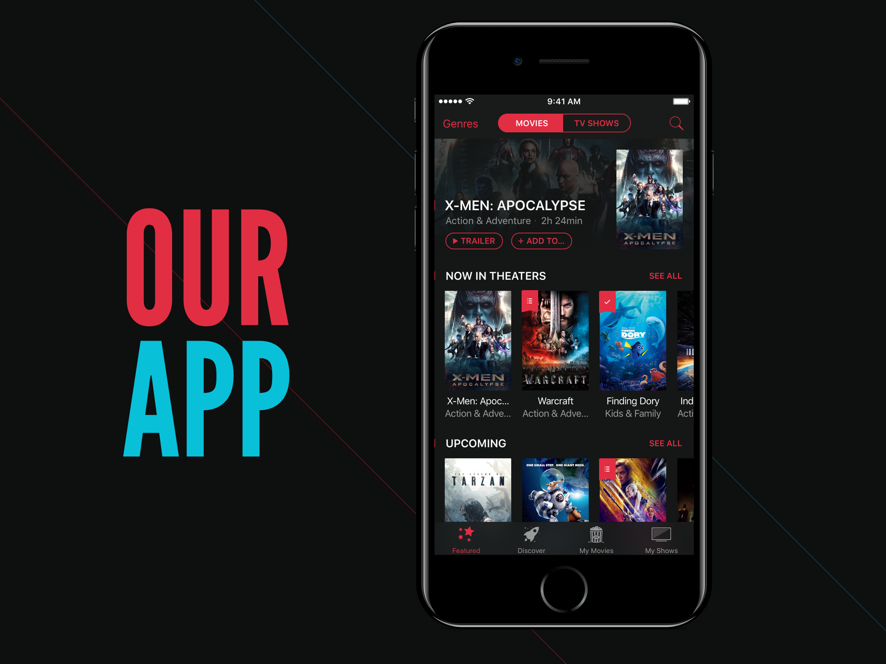

^ And here’s our app! We’ve been working on it for a while.

^ And to tell you about how we are building it, I’m gonna pass the baton to my partner in crime: Guille.

---

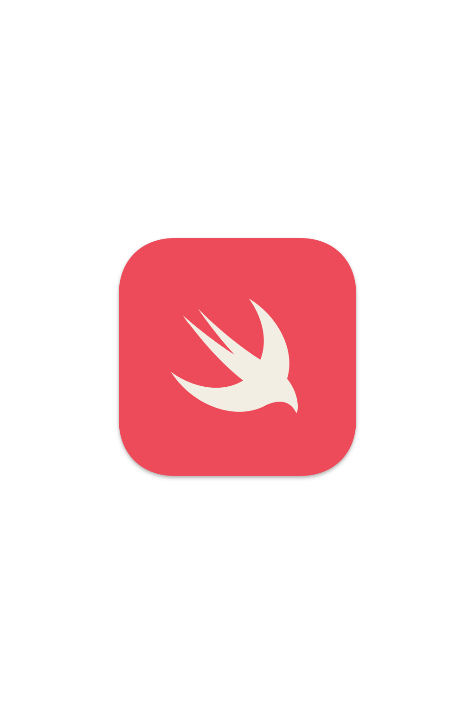

#### **— PART TWO —**
# [fit] Building 
# [fit] *UI Components*
# [fit] in Swift
#### <br>

^ Let me tell you something: working with a design that is made of reusable components makes a **HUGE** difference in your code.

^ What is a UI component?

---

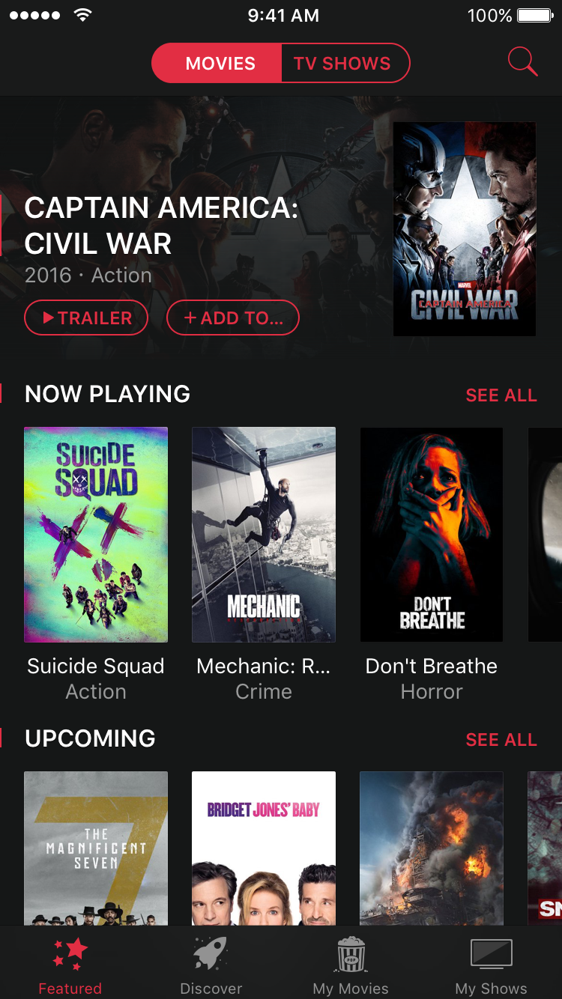

# <br>
# *UI* Components

- *Button, Label, PosterView, BackdropView*
- *PosterCell, CardCell*
- *ViewControllers!?*

^ Well, a UI component can be a simple atomic element like a button, label or a view to display a movie poster or backdrop.

^ It can also be an element composed of several atomic elements, like a cell in a collection view.

^ There is a third level: View Controllers, which are composed of several UI components and connected to some business logic.

^ Yeah, treating view controllers as visual components is great. I'll show you later.

^ Before addressing these, let’s talk about something that all of these components have in common.

---

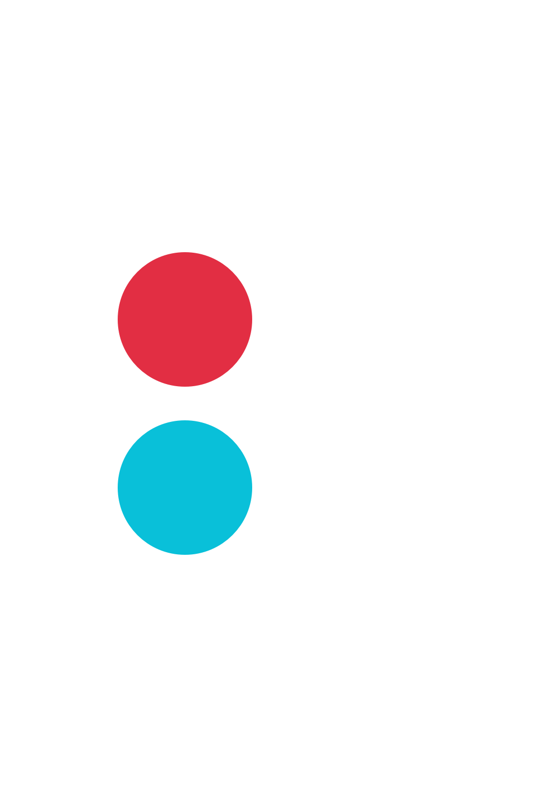

#### **First**
# [fit] Colors
# <br>

^ How do we deal with colors in our app?

---

#<br>
# DON’T

```swift
view.backgroundColor = UIColor(red: 0.09,
                             green: 0.08,
                              blue: 0.08,
                             alpha: 1.0)
```

^ Certainly, not like this.

^ This makes your app harder to maintain. It is error prone and most probably will lead to UI bugs when designers decide to update a particular color in the design.

^ Configuring colors in Interface Builder will have exactly the same consequences.

---

# Instead

- Name your colors
- *~~DarkGray~~, ~~OliveGreen~~*
- *Background, Text, Action*
- ❤️ **SwiftGen**[^  ]

[^  ]: [github.com/AliSoftware/SwiftGen](https://github.com/AliSoftware/SwiftGen)

^ Any design should come with a consistent color palette.

^ Colors should be named according to their use in the application.

^ Use SwiftGen to make your life easier.

---

# *Using* Swiftgen

```
Colors.txt

Movie:              #E22E43
Show:               #09C0D9
Background:         #151717
...
```

```bash
$ swiftgen colors Colors.txt --output Color.swift
```

```Swift
view.backgroundColor = UIColor(named: .Background)
button.tintColor = UIColor(named: .Movie)
...
```

^ SwiftGen is a tool that will generate Swift code for different kind of assets in your app.

^ You can use a text file to specify the color palette and then feed that to SwiftGen. It will generate a nice Swift enum and UIColor extension.

^ From that moment on you can refer to app colors in a type-safe way, using the provided constructor.

^ SwiftGen is indeed very cool and does much more than colors. We are using it for image assets and localizable strings.

---


#### **Second**
# [fit] Text 
# [fit] *Styles*
# <br>

---

# <br>
# DON’T

```swift
cell.textLabel.font = UIFont.systemFontOfSize(15)

UINavigationBar.appearance()
	.titleTextAttributes = [
		NSFontAttributeName: UIFont.systemFontOfSize(15),
		...
	]
```

^ As with colors, you should avoid configuring fonts and text attributes in your app this way, for the same reasons exposed before.

^ Instead, you should have a type-safe way to specify text styles in your app.

---

# <br>
# Modeling *Text Styles*

- *Font Name, Size, Weight*
- *Line Height, Kerning, Shadow*
- *Dynamic Type*

^ A simple text style can be defined using three properties: font name, size and weight.

^ We can define richer styles by adding other properties like line height, kerning, shadow, etc.

^ There is also Dynamic Type, which provides the user the ability to specify a preferred text size.

^ Here’s how we implemented our TextStyle model.

---

# Modeling *Text Styles*

```swift
enum TextStyle {

    case dynamic(style: UIFontTextStyle)

    case custom(
        size: CGFloat,
        weight: CGFloat,
        height: CGFloat?,
        dropShadow: Bool
    )
}
```

^ We are using an enum with one case for Dynamic Type based styles and other one for custom styles.

^ Our custom styles don't need a font name, as we are using the system font.

^ Likewise, there is no kerning property, as the default value for the system font is good enough.

^ We made the line height optional, as we need the system provided value for some styles.

---

# *Adding* Predefined Styles

```swift
extension TextStyle {

    static let body = TextStyle.dynamic(style: .body)

    static let headline = TextStyle.custom(size: 20,
                                           weight: UIFontWeightSemibold,
                                           height: 24,
                                           dropShadow: true)
    ...
}
```

^ Predefined styles are added as type level constants defining each style with the appropriate values.

^ In this example we have a **body** style based on a dynamic type style and a **headline** style based on a custom style.

---

# *Text Style* Additions

```swift
extension TextStyle {

    var font: UIFont {
        switch self {
        case let .dynamic(style):
            return UIFont.preferredFont(forTextStyle: style)
        case let .custom(size, weight, _, _):
            return UIFont.systemFont(ofSize: size, weight: weight)
        }
    }

    var stringAttributes: [String : AnyObject] {
        ...
    }
}
```

^ To be able to use our text styles with other UIKit components, we need to add some additional functionality.

^ In particular we need properties that return a UIFont instance and the string attributes for a given style.

---

# Using *Text Styles*

```swift
UINavigationBar.appearance()
	.titleTextAttributes = TextStyle.headline.stringAttributes
	
button.titleLabel?.font = TextStyle.callout.font

let headlineLabel = Label(textStyle: .callout)
let titleLabel = Label(textStyle: .body)
let metadataLabel = Label(textStyle: .caption)
```

^ With the text style model in place, we can now configure the text attributes of our UI components in a much nicer way.

^ For labels, we have our own UILabel subclass, which uses the text style model as a configuration object, updating the `attributedText` property automatically when the text or the style of the label changes.

^ Now if we need to add a new text style or update an existing one, there is only one place we need modify.

---

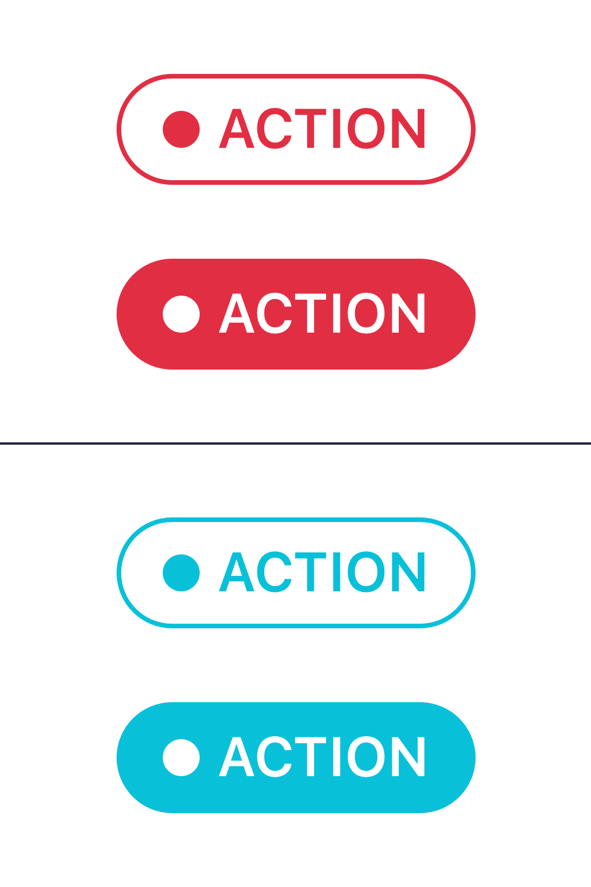

#### **Third**
# [FIT] *Customizing* 
# [FIT] Controls
# <br>

^ In our app, we have this pill-shaped buttons that can be displayed in different colors and styles like solid or outline.

^ Let’s see how we created our custom button class.

---

# <br>
# *Get to* know your tools

- *Image slicing*
- *Template rendering mode*

^ Of course we want our buttons to resize nicely based on the contents. So drawing them using CoreGraphics may seem the right approach.

^ But before going down that road, think about what you can do with images.

^ UIKit can work with stretchable images, which can be created programmatically or using the Image Slicing Editor in the Xcode Asset Catalog.

^ What about coloring the buttons?

^ An often overlooked feature of UIImages is that you can treat them as template images, which are images that can be re-colored using the `tintColor` property of the view displaying them.

---


^ This screenshot shows how the button images are sliced to make them resizable and configured to be rendered as template images in the property inspector.

^ Notice that button image assets are black. Color information is discarded for template images, so we don’t really care about the color in the asset.

^ In fact, we think it is a good practice to use black for template images, just as a reminder.

---

# Modeling *Button Styles*

```swift
final class Button: UIButton {

    struct Style {
        let titleColor: UIColor?
        let normalBackgroundImage: UIImage?
        let highlightedBackgroundImage: UIImage?
    }
}
```

^ As I mentioned earlier, our app has two different button styles: outline and solid.

^ Each style has its own background images and title color.

^ We use a configuration model to encapsulate those button styles.

^ This is the same technique we used for the text styles. It allows us to add more styles in the future without changing too much code.

---

# *Adding* Predefined Button Styles

```swift
extension Button.Style {

    static let outline = Button.Style(
        titleColor: nil,
        normalBackgroundImage: UIImage(asset: .ButtonBackgroundOutline),
        highlightedBackgroundImage: UIImage(asset: .ButtonBackgroundHighlighted),
    )

    static let solid = Button.Style(
        titleColor: UIColor(named: .Text1),
        normalBackgroundImage: UIImage(asset: .ButtonBackgroundSolid),
        highlightedBackgroundImage: nil
    )
}
```

^ As with text styles, we add our predefined button styles as type level constants, each with the appropriate images and colors.

---

# Using *our custom buttons*

```swift
let button = Button(title: "ADD TO…",
                    style: .outline,
                    icon: .add)

button.style = .solid
button.icon = .checkmark
button.title = "WATCHED"
button.tintColor = UIColor(named: .show)
```


^ And this is how we create and modify buttons.

^ We can provide the title and the style during construction and change it later using the corresponding properties.

---

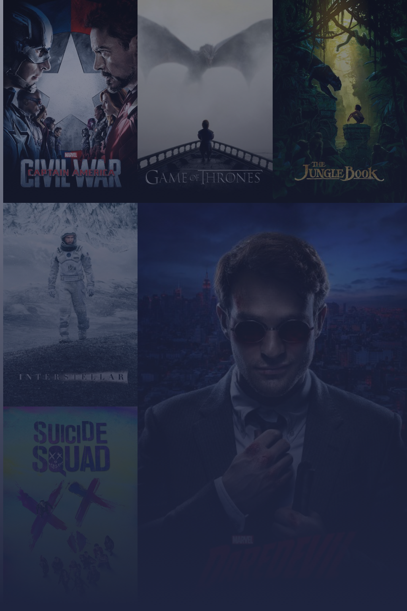

#### **Fourth**
# [FIT] *Displaying* 
# [FIT] Images
# <br>

^ Images are a crucial element in our application.

^ Most of the screens display backdrops and posters of Movies and TV Shows or people’s profile pictures.

---

# <br>
# *Image* Requirements

- Download *and* decode *off the main thread*
- Post-process *off the main thread*
- Cache *original and post-processed images*

^ There a few things to consider when working with images.

^ Images should be downloaded and decoded off the main thread.

^ Likewise, any post-processing must be done in a background thread.

^ This is **really** important, specially when displaying images in table views or collection views.

^ Finally we would like to cache both original and post-processed images. This will save lots of network requests and CPU cycles.

---

### ❤️ **PINRemoteImage**[^   ]

[^   ]: [github.com/pinterest/PINRemoteImage](https://github.com/pinterest/PINRemoteImage)

^ Implementing image downloading and caching properly is not a simple task, and requires time. So we looked for an open source library that meet our requirements.

^ And we found PINRemoteImage.

^ Let me show you how we use it to download and post-process backdrops.

---

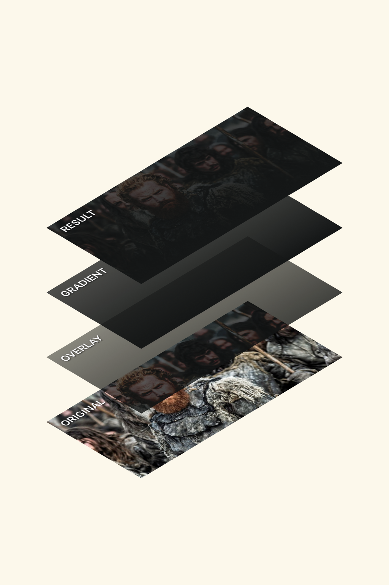

# [fit] Backdrops

^ When we display a backdrop in the background, we need to add a darkened finish to it, so that other components that lay on top can stand out.

^ We accomplish this by compositing a couple of gradients on top of the original backdrop image, using different blending modes.

---


# <br>
# Backdrops

```swift
imageView.pin_setImageFromURL(
    imageURL,
    processorKey: "backdrop"
) { result, _ in
    return result.image?.composited(
        withImages: [
            (overlayGradient, .Overlay, 1),
            (gradient, .Normal, 1)
        ]
    )
}
```

^ This code shows how to download an image and post-process it using PINRemoteImage.

^ It is important to keep the processor key unique for each different kind of post-processing, as PINRemoteImage appends it to the cache key for the image, which is the URL.

^ For the composition we are using our own UIImage category which leverages some Core Graphics magic to get the job done.

^ Notice that if the image has been downloaded before, the cached version will be returned and the processing closure will not be executed.

---


#### **Fifth**
# [FIT] *Reusing* 
# [FIT] View Controllers
# <br>

^ OK, let’s play a game.

^ Look at the video and try to figure out how many view controllers we have under the Featured Tab.

^ Tic, tac.

^ There are 10, including the Navigation Controller.

^ Let’s have a look at some of them.

---

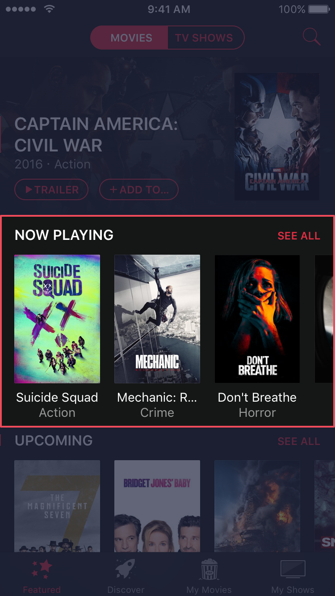

```swift
ItemStripViewController<T>

init(
  resource: Resource,
  configure: (ItemCell, T) -> ()
)
```

^ This view controller displays a list of contents as a strip of posters with some descriptions.

^ It is generic because it can be used to display different kinds of content: Movies, Shows or People.

^ Cell configuration is provided in the constructor. This allows  for example to display the genre in the **Now Playing** strip and the release date in the **Upcoming** strip.

^ The other thing provided in the constructor is the resource needed to be fetched to get the contents: Movies now playing, Shows airing today, etc.

^ The view controller forwards this value to a business logic component that will return the items to display.

---

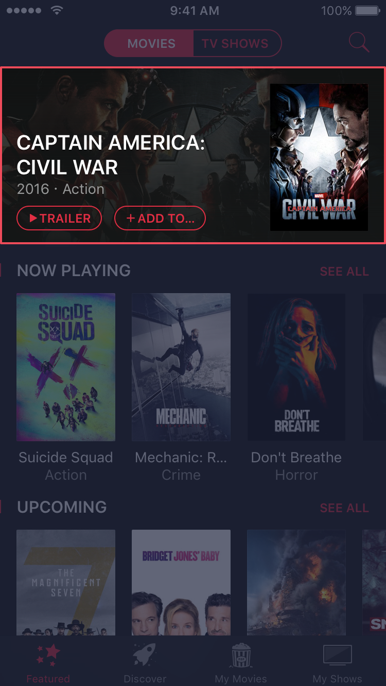

```swift
ItemCarouselViewController<T>

init(
  resource: Resource,
  configure: (CardItemCell, T) -> ()
)
```

^ This view controller display a list of items as cards.

^ As there is more real state, it displays more information about each element and provides a couple of additional interactions.

^ The constructor is very similar to the previous one. It only differs on the cell type.

^ In fact, this view controller uses the same business logic than the previous one. It just provides a different way to present and interact with a list of items.

---

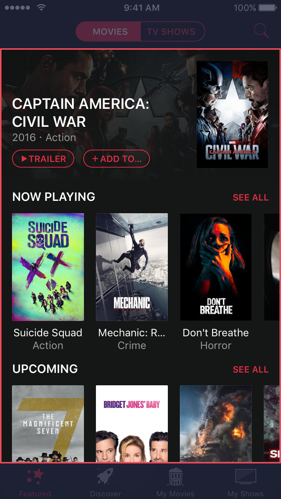

```swift
StackViewController

init(
  viewControllers: [UIViewController]
)
```

^ This view controller is just a container that lays out the provided view controllers in a vertical stack.

---

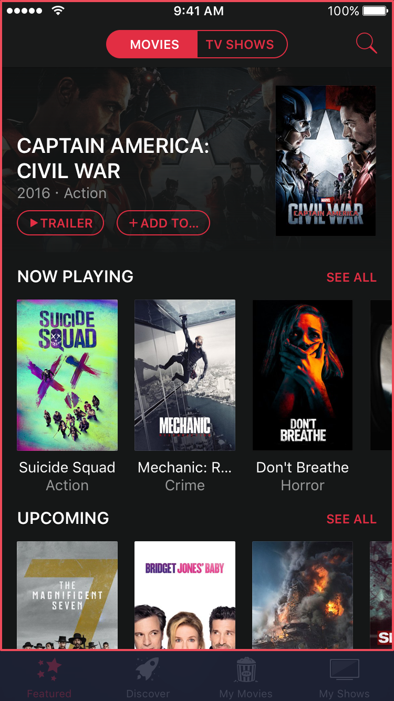

```swift
SegmentedViewController

init(
  viewControllers: [UIViewController]
)
```

^ And finally, another container that creates a segmented control and configures it with the titles of the provided view controllers, allowing to switch between them.

---

# <br>
# *Reusing* View Controllers

- *Forget* Storyboards
- *Separate* navigation *logic*
- *Separate* business *logic*
- Configurable

^ Let me summarise what is needed to make good reusable view controllers.

^ First of all, don’t use Storyboards. They will get in the way with segues and what not. Consider going 100% interface builder free. Working with auto layout in code is easier than ever since iOS 9 with layout anchors and guides.

^ Get rid of coupling between view controllers by moving navigation logic one layer up. You can use routers or coordinators, both are similar concepts.

^ Move business logic one layer down. You can use view models, interactors, etc.

^ Make your view controllers configurable. You can use generics and/or provide configuration closures.

---


<br>
# [fit]*“Tank”* You!!

#### *@pumpkin* **+** *@gonzalezreal*

---

# Acknowledgements

- [iOS App icon template](https://sketchapp.com) **by** *Sketch Team*
- [12 Free Reaction Emojis](https://dribbble.com/shots/2842872-12-Free-Reaction) **by** *Marc Gonzales*
- [Making sense of MVP](http://blog.crisp.se/2016/01/25/henrikkniberg/making-sense-of-mvp) **by** *Henrik Kniberg*
- [iOS Devices](http://robbiepearce.com/devices) **by** *Robbie Pearce*
- [“Tank” You](https://youtu.be/bS5P_LAqiVg?t=17m25s) **from** *Kung Fury* **by** *David Sandberg*

#### Made in *@decksetapp* **+** *@sketchapp*